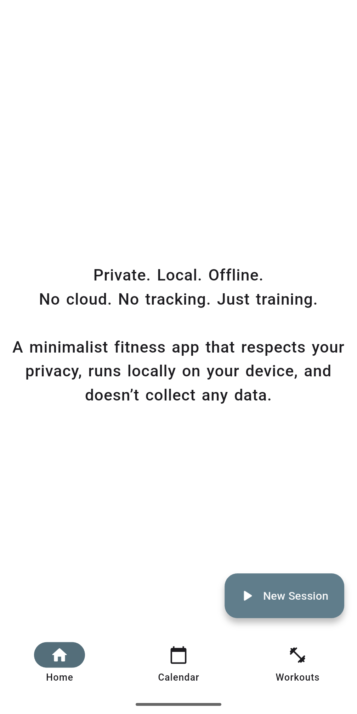
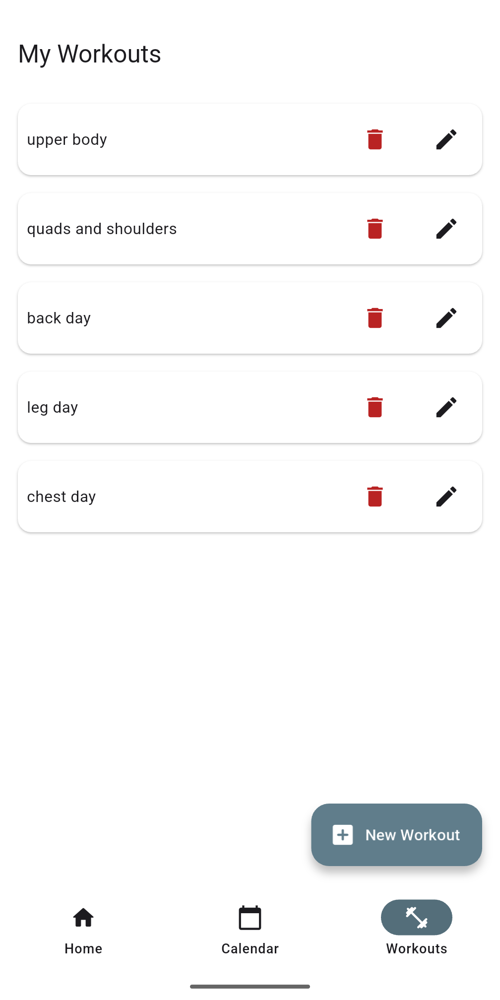
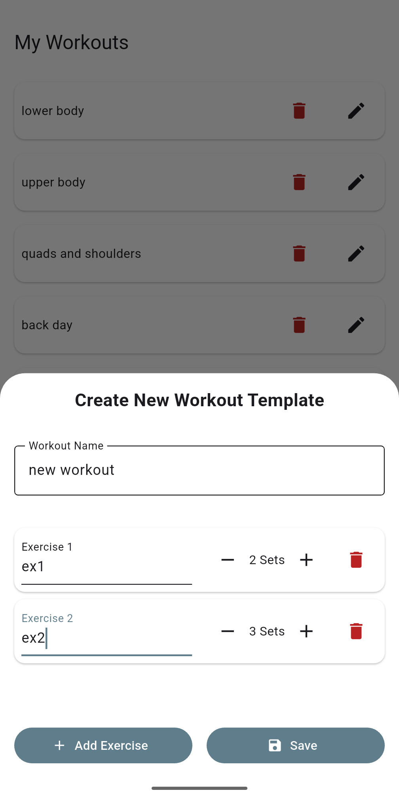
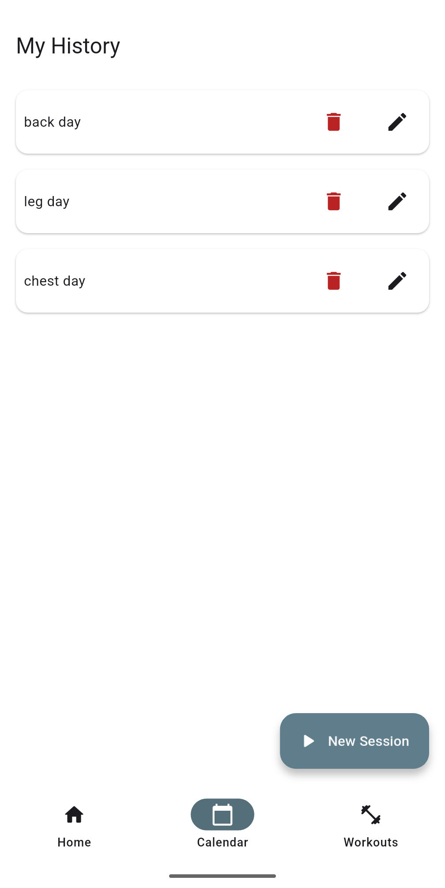
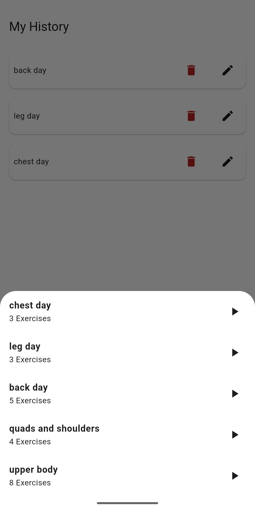
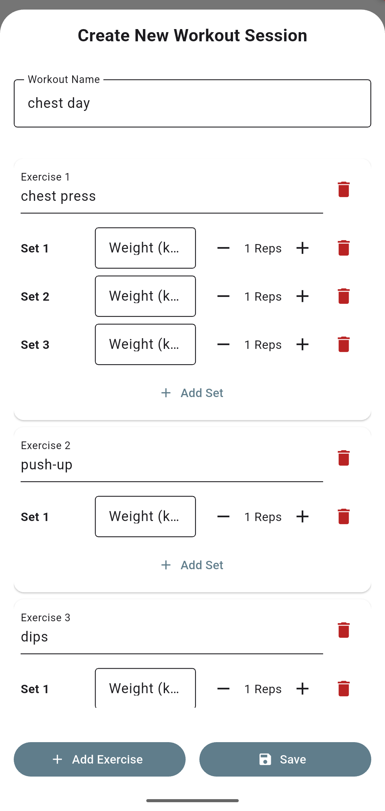

# GymTracker
_Fitness App to track your gym progress – Built with Flutter & Android Studio_

[](https://github.com/Stefano-Bozzi/GymTracker-App/releases)
[](https://github.com/Stefano-Bozzi/GymTracker-App/blob/master/LICENSE.md)
[](https://flutter.dev/)
[](https://dart.dev/)
[](https://developer.android.com/studio)
[](https://isar-community.dev/)
[](https://github.com/Stefano-Bozzi/GymTracker-App)

**GymTracker** is an offline-first smartphone application that helps users track their gym workouts, manage routines, and monitor their progress over time.

### **Philosophy** 
This project was born out of the need for a **free, minimalist,** and above all, **private** alternative to modern fitness apps. GymTracker does not collect your personal data, requires no accounts, contains no ads, and expects no rewards in return.

### 🚧 **Status:** Active development (v0.1.0)
The core architecture, local database management, and workout tracking flows are fully functional. Analytics and UI refinements are currently being built.

### App Overview


<table width="100%" align="center">
  <tr>
    <td width="16.6%" align="center">
      <br><br><b>1. Home<br>Tab</b>
    </td>
    <td width="16.6%" align="center">
      <br><br><b>2. Workouts<br>Tab</b>
    </td>
    <td width="16.6%" align="center">
      <br><br><b>3. Create<br>Template</b>
    </td>
    <td width="16.6%" align="center">
      <br><br><b>4. Calendar<br>Tab</b>
    </td>
    <td width="16.6%" align="center">
      <br><br><b>5. Start<br>Session</b>
    </td>
    <td width="16.6%" align="center">
      <br><br><b>6. Track<br>Session</b>
    </td>
  </tr>
</table>

1. **Home Page:** The app's core philosophy—private, local, and offline.
2. **Workouts Tab:** Manage and view your custom workout templates.
3. **Create Template:** Build a new routine by adding exercises and default sets.
4. **Calendar Tab (My History):** View your chronological history of completed sessions.
5. **Start Session:** Select a pre-saved template to begin your daily workout.
6. **Track Session:** Log your actual weight and reps in real-time.

## Current Features
* **Workout Templates:** Create, edit, and manage custom workout routines with specific exercises.
* **Session Tracking:** Start a new workout session instantly by choosing a pre-saved template.
* **Granular Tracking:** Dynamically add, edit, or remove individual sets during a workout, recording both **Weight (kg)** and **Reps**.
* **Workout History:** View a chronological list of all your completed workout sessions in the Calendar tab.
* **100% Offline & Private:** All data is securely stored locally on your device. No cloud syncing, zero privacy risks.

---

## Installation

⚠️ **Disclaimer: IT IS YOUR CHOICE TO PROCEED.** By downloading and installing this application outside of official App Stores, you assume all responsibilities. I do not provide technical support for device configurations, sideloading issues, or OS restrictions.

### Download for Smartphone (Users)
You can download and install the app directly on your device:

* **Android:** Go to the [Releases page](https://github.com/Stefano-Bozzi/GymTracker-App/releases), download the latest `.apk` file, and open it on your phone to install (you may need to allow installations from unknown sources in your settings).
* **iOS:** Due to Apple's restrictions, direct installation is not currently available.

### Build from Source (Developers)
To test the application locally on your machine or emulator:

1. Ensure you have [Flutter](https://docs.flutter.dev/get-started/install) installed.
2. Clone the repository:
    ```bash
    git clone https://github.com/Stefano-Bozzi/GymTracker-App.git
    ```
3. Navigate to the project directory and fetch the dependencies:
    ```bash
    cd GymTracker-App
    flutter pub get
    ```
4. Run the app on your connected device or emulator:
    ```bash
    flutter run
    ```

## Usage Instructions
1. Navigate to the **Workouts** tab to create your first Workout Template. Add exercises and default sets.
2. Navigate to the **Calendar** tab and tap the **+** (New Session) button.
3. Select the template you just created.
4. The app will generate a ready-to-use session: input your actual Weight and Reps for each set and hit **Save** to log your progress!

## History
See the file [CHANGELOG.md](https://github.com/Stefano-Bozzi/GymTracker-App/blob/master/CHANGELOG.md).

## Contributing

Contributions are welcome!  
If you'd like to report a bug, suggest a feature, or submit code, feel free to open an issue or a pull request.  
Please include a clear and detailed description of your changes or suggestions.

➡️ Make sure to update tests as appropriate, and check for compatibility with the existing codebase.

## License
The code is released under the MIT License. The MIT License is a permissive software license from the Massachusetts Institute of Technology that places very few restrictions on reuse. For more details and the complete license text, see the [LICENSE.md](./LICENSE.md) file.

This project uses packages required for proper functionality, many of which are already included and automatically installed via Flutter and Android Studio. Third-party licenses have been grouped in the [THIRD_PARTY_LICENSES.md](./THIRD_PARTY_LICENSES.md) file.

## Credits
The application logo utilize the **Bruno Ace SC** font:
* **Source:** [Google Fonts - Bruno Ace SC](https://fonts.google.com/specimen/Bruno+Ace+SC)
* **License:** SIL Open Font License, Version 1.1

## Author
Developed by [Stefano-Bozzi](https://github.com/Stefano-Bozzi).